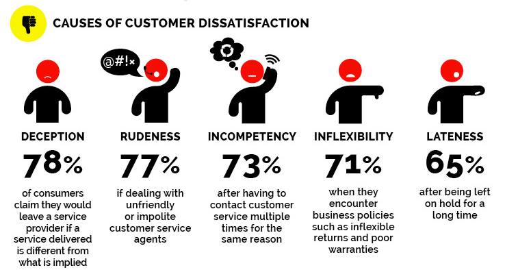

# FCB-data-analysis-project-1

## Project outline
This project outline aims to provide a comprehensive framework for investigating customer satisfaction towards different network providers in Nigeria. The study's findings will contribute to the existing literature and offer valuable insights for network providers to enhance their services and improve customer satisfaction.

## Background of study
The telecommunications industry in Nigeria has experienced significant growth in recent years, with multiple network providers offering services to customers.

## Problem statement
With various options available, customers often face challenges in selecting the best network provider that meets their needs, leading to dissatisfaction.

## Overview
The Nigerian telecommunications industry is semi-fragmented, with major players like MTN Nigeria Communications PLC, Airtel Networks Limited, Globacom Limited, and 9Mobile. The industry has seen growth in recent years, driven by government initiatives, IoT usage, and increasing smartphone adoption. However, there are still challenges, such as high capital expenditure requirements and changing consumer preferences. The industry is expected to continue growing, driven by mobile services, particularly 4G and 5G, and increasing demand for data and digital services.

## Existing Research on Customer Satisfaction and Network Providers
This section reviews existing studies on customer satisfaction with network providers, highlighting key findings on factors that influence satisfaction and dissatisfaction. Existing research has identified several key themes:
- Network Quality: Studies have consistently shown that network quality is a crucial factor in customer satisfaction e.g Dropped calls, poor coverage, and slow data speeds are common sources of dissatisfaction.
- Customer Service: Effective customer service is essential for customer satisfaction e.g Long waiting times, unhelpful staff, and unresolved issues lead to dissatisfaction.
- Pricing and Billing: Customers are sensitive to pricing and billing issues, with transparent and competitive pricing contributing to satisfaction.
- Data and Internet Services: The quality and availability of data and internet services significantly impact customer satisfaction.
- Value-Added Services: The provision of value-added services, such as mobile banking and entertainment, can enhance customer satisfaction.
- Brand Image and Loyalty: A strong brand image and loyalty programs can influence customer satisfaction and retention.
- Demographic Factors: Demographic factors, such as age, gender, and income, can influence customer satisfaction with network providers.
  
These factors are interconnected and can impact one another. For instance, poor network quality can lead to customer service issues, which can further exacerbate dissatisfaction.

## The factors influencing customer dissatisfaction in networks and their providers 
The factors influencing customer dissatisfaction in networks and their providers can be categorized into five main areas:
1. Network Performance
- Poor network coverage and connectivity
- Slow data speeds and buffering
- Frequent dropped calls and poor voice quality
- Unreliable connections and disconnections
2. Customer Service
- Long wait times and unhelpful customer support
- Unresolved issues and complaints
- Lack of transparency and communication
- Unfriendly and unapproachable customer service representatives
3. Pricing and Billing
- Perceived high costs for services and data plans
- Unexpected charges and billing errors
- Limited data options and high data costs
- Difficulty making payments and managing accounts
4. Value-Added Services
- Limited or poor quality of value-added services (e.g., streaming, gaming, entertainment)
- Difficulty accessing and using value-added services
- Lack of personalized recommendations and offers
5. Brand and Reputation
- Negative brand reputation and perceived poor quality
- Lack of trust and confidence in the network provider
- Unfriendly and unapproachable brand image
- Failure to offer innovative and cutting-edge services and technologies
These factors can lead to customer dissatisfaction, churn, and negative word-of-mouth, ultimately affecting the network and telecommunications provider's reputation and revenue.

## Recommendations for Network Providers to Improve Customer Satisfaction
Based on the findings and analysis of this project. I will recomend

1. Network Performance
- Invest in infrastructure upgrades to improve network coverage, speed, and reliability.
- Implement advanced technologies like 5G, fiber optics, and small cells to enhance network performance.
- Conduct regular maintenance and upgrades to minimize downtime and outages.
2. Customer Service
- Implement a 24/7 customer support system with multiple channels (phone, email, chat, social media).
- Train customer support representatives to be friendly, helpful, and empowered to resolve issues.
- Introduce a ticketing system to track and resolve customer complaints efficiently.
3. Pricing and Billing
- Offer competitive pricing and data plans that meet customers' needs.
- Introduce flexible billing options (e.g., pay-as-you-go, data rollover).
- Provide clear and transparent billing information to avoid unexpected charges.
4. Value-Added Services
- Offer a range of value-added services (e.g., streaming, gaming, entertainment) that meet customers' interests.
- Develop personalized recommendations and offers based on customers' usage and preferences.
- Introduce a loyalty program to reward customers for their loyalty and usage.
5. Brand and Reputation
- Invest in marketing campaigns to improve brand image and reputation.
- Encourage customer feedback and respond promptly to customer complaints.
- Develop a customer-centric culture within the organization to prioritize customer satisfaction.
6. Communication
- Keep customers informed about network upgrades, maintenance, and outages through timely notifications.
Provide clear and concise information about services, plans, and pricing.
- Encourage two-way communication through social media and other channels.
7. Employee Training
- Train employees to be customer-centric and empowered to resolve issues.
- Provide ongoing training and development programs to enhance employee knowledge and skills.
- Encourage employee feedback and suggestions to improve customer satisfaction.
8. Customer Engagement
- Develop a customer engagement program to reward loyal customers and encourage retention.
- Offer personalized services and recommendations based on customers' usage and preferences.
- Encourage customer participation in product development and feedback sessions.
  
By implementing these recommendations, network providers can improve customer satisfaction, loyalty, and retention, ultimately driving business growth and revenue.



|Heading 1| Heading2 | Heading 3|
|---------|----------|----------|
|Data 1 | Data 2 | Data 3 |

## Tools used
1. Microsoft Excel for data cleaning [Download here](https://www.microsoft.com/en-us/microsoft-365/excel?ocid=ORSEARCH_Bing)


   ```

   Goggle query sheet

   SELECT * FROM TABLE 1
   WHERE CONDITION = NET
