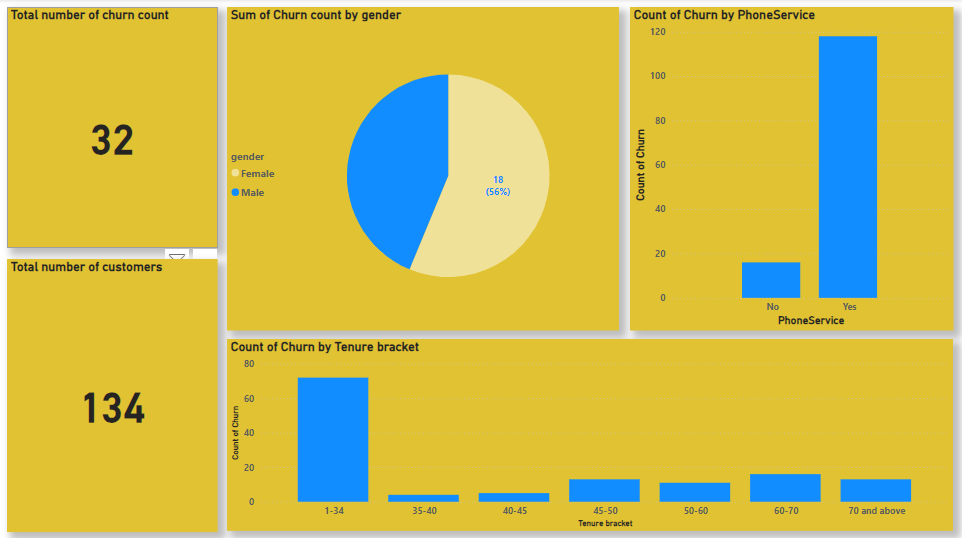
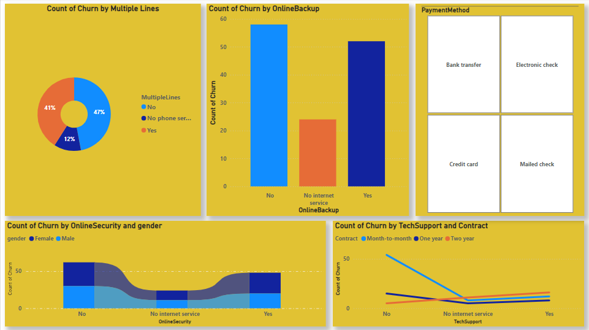

# GAGE TECH CUSTOMER CHURN RATE ANALYSIS

## Description

GAGE TECH is a top telecom provider in Redemption City of God, offering advanced fiber optic and DSL internet since 2015. Our network delivers speeds up to 1 Gbps with ultra-low latency, ideal for streaming, gaming, and remote work. We're dedicated to customer satisfaction, innovation, and bridging the digital divide.

## Overview
This dataset contains different customers level information for GAGE TECH customers. Different attributes related to the services used were recorded with focus on all factors influencing their dissatisfaction.

#### This reports details the analysis of customer dissatisfaction towards Gage Tech. in the last 2years. The study findings will contribute to the existing literature and offer valuable insights for this company to enhance their services and improve customer satisfaction.

## Background of study
The telecommunications industry in Nigeria has experienced significant growth in recent years, with multiple network providers offering services to customers.

## Problem statement

- What variables factors are contributing to customer churn and dissatisfaction?
- Who are the customers more likely to churn?
- What actions can be taken to stop them from leaving?

## Data Source

The dataset for this project was obtained from this website: [**Kaggle**](https://www.kaggle.com/datasets/barun2104/telecom-churn)

## Tools Used
- Ms. Excel was used to collate the dataset: [**Excel**](https://www.microsoft.com/en-us/microsoft-365/excel)
- Power BI was used for data cleaning, transforming and visualization: [**Power BI**](https://www.microsoft.com/en-us/download/details.aspx?id=58494)

## Summary 
Leveraged AI tools and machine learning algorithms to analyze customer data, identifying key drivers of churn. Collaborated with Gage Tech's team to integrate findings into their CRM system, enabling data-driven decision-making. This project showcases my expertise in AI-driven data analysis, project management, and collaborative problem-solving. From the analysis the major factors that promotes the rate of chunning and dissatisfaction amongst Gage tech users include;
- Tenure
- phone service
- Technical support
- Online Backups
- Gender
- Monthly Charges
- Online services
- payment methods
- online security
  
    
  
---

## Recommendations for Gage Tech to Improve Customer Satisfaction
Based on the findings and analysis of this project. I will recomend

1. Network Performance
- Invest in infrastructure upgrades to improve network coverage, speed, and reliability.
- Implement advanced technologies like 5G, fiber optics, and small cells to enhance network performance.
- Conduct regular maintenance and upgrades to minimize downtime and outages.
2. Customer Service
- Implement a 24/7 customer support system with multiple channels (phone, email, chat, social media).
- Train customer support representatives to be friendly, helpful, and empowered to resolve issues.
- Introduce a ticketing system to track and resolve customer complaints efficiently.
3. Pricing and Billing
- Offer competitive pricing and data plans that meet customers' needs.
- Introduce flexible billing options (e.g., pay-as-you-go, data rollover).
- Provide clear and transparent billing information to avoid unexpected charges.
4. Value-Added Services
- Offer a range of value-added services (e.g., streaming, gaming, entertainment) that meet customers' interests.
- Develop personalized recommendations and offers based on customers' usage and preferences.
- Introduce a loyalty program to reward customers for their loyalty and usage.
5. Brand and Reputation
- Invest in marketing campaigns to improve brand image and reputation.
- Encourage customer feedback and respond promptly to customer complaints.
- Develop a customer-centric culture within the organization to prioritize customer satisfaction.
6. Communication
- Keep customers informed about network upgrades, maintenance, and outages through timely notifications.
Provide clear and concise information about services, plans, and pricing.
- Encourage two-way communication through social media and other channels.
7. Employee Training
- Train employees to be customer-centric and empowered to resolve issues.
- Provide ongoing training and development programs to enhance employee knowledge and skills.
- Encourage employee feedback and suggestions to improve customer satisfaction.
8. Customer Engagement
- Develop a customer engagement program to reward loyal customers and encourage retention.
- Offer personalized services and recommendations based on customers' usage and preferences.
- Encourage customer participation in product development and feedback sessions.
  
By implementing these recommendations, network providers can improve customer satisfaction, loyalty, and retention, ultimately driving business growth and revenue.

